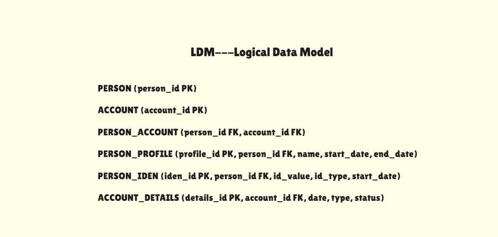
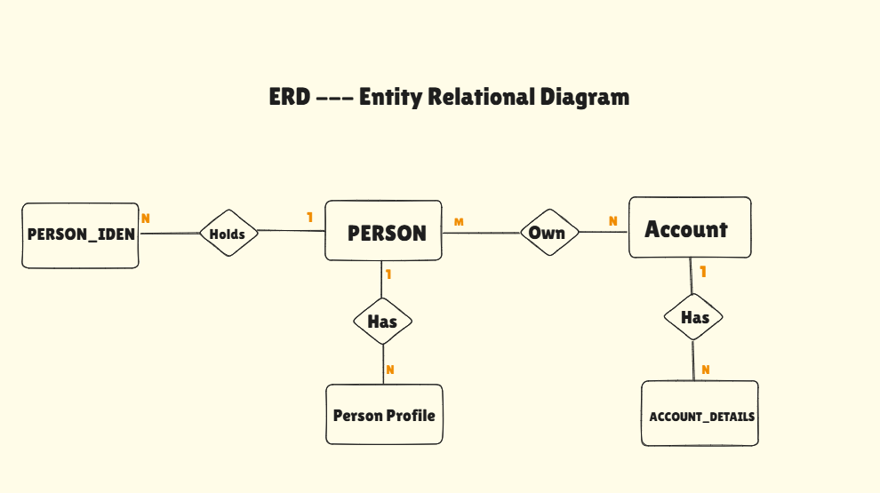
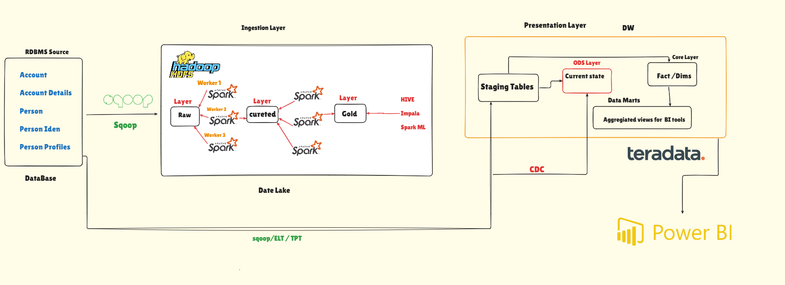

# Teradata DWH and PySpark Data Lake pipeline

This repository contains my solution for an dataflow task with two parts:

- Build a Data Warehouse using SQL
- Build a Data Lake using PySpark


## Repository Structure

```text
.
├── docs
│   └── diagrams
│       ├── ERD.png
│       ├── LDM.png
│       ├── Relational Schema - PDM.png
│       └── pipeline.png
├── spark
│   └── pyspark_build_datalake.py
├── sql
│   ├── design
│   │   └── PDM.sql
│   ├── staging
│   │   └── stg-teradata.sql
│   └── warehouse
│       ├── DW.sql
│       └── ELT-STG_TO_Dim_fact
└── README.md
```

## Source Data Provided In The Task

The source image contains five business tables and a table-size note:

1. `Accounts`
   Columns: `Acc no`, `Date`, `Status`

2. `Account Details`
   Columns: `Acc no`, `Date`, `type`

3. `Person`
   Columns: `Acc no`, `Person`

4. `Person Profile`
   Columns: `Person`, `Name`, `Date`

5. `Person Iden`
   Columns: `Person`, `Id`, `Date`

The size note in the picture shows:

- `Accounts`: `3T`
- `Account Details`: `2T`
- `Person`: `1T`
- `Person Profile`: `1T`
- `Person Iden`: `3T`

These source tables describe:

- account status history
- account type history
- the many-to-many relationship between persons and accounts
- person profile history
- person identification history

## Diagrams

### LDM

The LDM represents the business-level interpretation of the source entities and their relationships.



### ERD

The ERD shows the logical warehouse entities and how they relate to each other.



### PDM

The PDM shows the physical relational design used for implementation.


The SQL definition for the physical model is also included here:

- `sql/design/PDM.sql`

### Pipeline

The pipeline diagram shows the movement from source ingestion to curated and gold layers.



## Target Warehouse Model

Based on the design diagrams, the warehouse is organized around these main tables:

- `DIM_PERSON`
  - surrogate key: `person_sk`
  - business key: `person_id`
  - tracks person name history using SCD Type 2

- `DIM_ACCOUNT`
  - surrogate key: `account_sk`
  - business key: `acc_no`
  - tracks account status and account type history using SCD Type 2

- `DIM_PERSON_IDEN`
  - surrogate key: `iden_sk`
  - linked to `person_sk`
  - stores identifier value, identifier type, and effective start date

- `BRIDGE_PERSON_ACCOUNT`
  - resolves the many-to-many relationship between person and account

- `FACT_ACCOUNT_SNAPSHOT`
  - stores a dated snapshot using `date_sk`, `person_sk`, and `account_sk`

## SQL Implementation

The SQL part is split into these files:

- `sql/staging/stg-teradata.sql`
  - creates staging tables based on the provided source structure

- `sql/warehouse/DW.sql`
  - creates the warehouse tables

- `sql/warehouse/ELT-STG_TO_Dim_fact`
  - loads dimensions, bridge, and fact tables from staging

- `sql/design/PDM.sql`
  - contains the physical relational model definition

### Historical Rules

- staging keeps `eff_date`
- dimensions use `start_date` and `end_date`
- open rows use `9999-12-31`
- `is_current = 1` identifies the latest dimension version

### SCD Type 2 Logic

- `DIM_PERSON` creates a new version when `person_name` changes for the same `person_id`
- `DIM_ACCOUNT` creates a new version when either `acc_status` or `acc_type` changes for the same `acc_no`
- old rows close with `end_date = next effective date - 1 day`

## PySpark Implementation

The PySpark solution is located in:

- `spark/pyspark_build_datalake.py`

It follows a medallion-style flow:

- Raw
  - ingest source tables using JDBC
  - store raw copies in ORC

- Curated
  - standardize columns
  - clean dates and values
  - remove duplicates
  - derive `id_type`

- Gold
  - build SCD Type 2 dimensions
  - generate surrogate keys in the gold dimensions
  - resolve bridge records using surrogate keys
  - build the snapshot fact table

## Main Design Decisions

- Natural keys are preserved in staging and curated layers.
- Surrogate keys are introduced in the warehouse and gold dimensions.
- The bridge table stores surrogate keys, not natural keys.
- The fact table is built from resolved dimension keys.
- The SQL and PySpark implementations follow the same business rules.

## How To Review

For the SQL part:

1. Run `sql/staging/stg-teradata.sql`
2. Run `sql/warehouse/DW.sql`
3. Load the provided sample data into staging
4. Run `sql/warehouse/ELT-STG_TO_Dim_fact`

For the PySpark part:

1. Configure the JDBC connection in `spark/pyspark_build_datalake.py`
2. Run the PySpark job
3. Review the gold outputs

## Summary

This repository now separates:

- design artifacts in `docs/diagrams` and `sql/design`
- staging and warehouse SQL in `sql`
- data lake logic in `spark`


